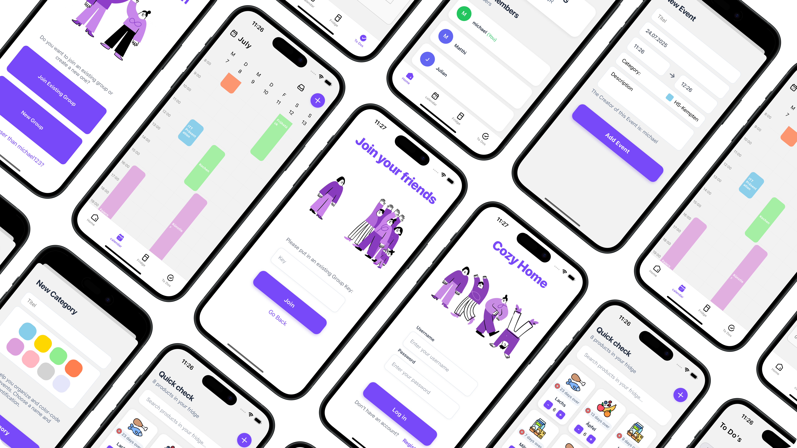

# Welcome to Cozy Home👋



Are you part of a shared flat or family and does this sound familiar? When is that appointment again? Who is taking out the trash? Do we have enough groceries in the fridge? Cozy Home is here to help!

Cozy Home is a management tool for shared flats, families, and partnerships, offering support in task distribution and helping to keep track of appointments, events, and supplies.

## Features
*   **Together Calendar:** Keep track of all important dates and events in one place.
*   **Together Fridge:** Manage your groceries, see what's available, and what needs to be bought.
*   **Together Todos:** Distribute and manage household chores and other tasks.
*   **Groups:** Organize everything within your shared flat, family, or group.

## Getting Started

This application requires a running [Appwrite](https://appwrite.io/) instance for its backend.

1. **Set up Appwrite**

   This app will not work without a configured Appwrite backend. You need to set up your own Appwrite instance and create a project. You will also need to configure the necessary collections and permissions.

2. **Install Dependencies**

   ```bash
   npm install
   ```

3. **Start the App**

   ```bash
   npx expo start
   ```
   A QR code will appear in the terminal, along with options to run the app on different platforms.

4. **Run the App**

   To open the project on your smartphone, you need to install the Expo Go app first. After successful installation, you can scan the QR code from the terminal. This will redirect you to Expo, and the app will start automatically on your smartphone.

Enjoy testing our app, Cozy Home!

## Further Information:

- [Expo documentation](https://docs.expo.dev/): 
- [Learn Expo tutorial](https://docs.expo.dev/tutorial/introduction/)


## Icons
Some icons are from Flaticon.

Icons for the virtual fridge:
https://www.flaticon.com/search?author_id=1&style_id=15&type=standard&word= (Lineal color by Freepik)

Example for attribution:
<a href="https://www.flaticon.com/free-icons/food" title="food icons">Food icons created by Freepik - Flaticon</a>

## Additional 
This project was part of a group project in 'Hochschule Kempten'. 
Developed by: Michael Stöhr, Cedric DeJarnatt, Samuel Käufler, Sophia Schade, Matthias Steger, Michael Stöhr, Julian Wirth